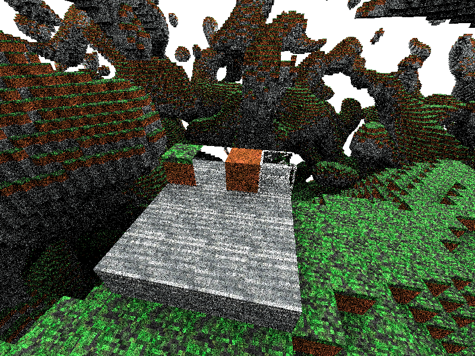
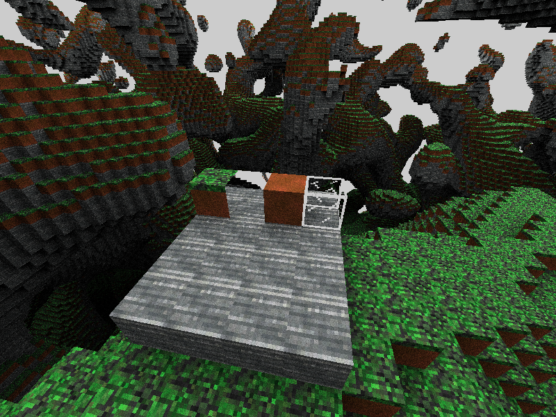

# Vulkan Raytraced Voxel Renderer

Some pictures:

### 8 samples per pixel, 4 bounces (28 fps)


### 128 samples per pixel, 4 bounces (3 fps)


## How to build

Install shaderc and the Vulkan SDK.

Then:
```bash
cargo build --release
```

## How to modify image assets
Block textures can be found in the `assets/blocks/` directory.
