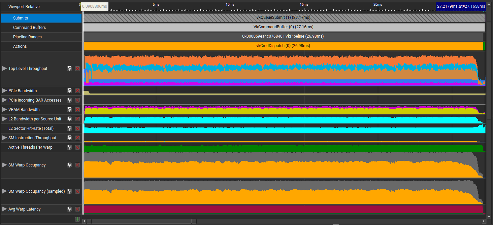
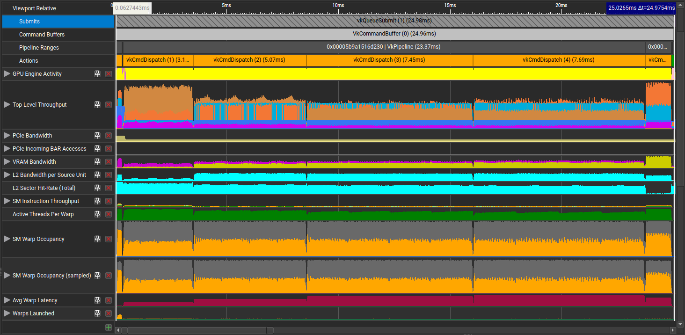

# Vulkan Raytraced Voxel Renderer

Some pictures:

### 8 samples per pixel, 4 bounces (28 fps)


### 128 samples per pixel, 4 bounces (3 fps)


## How to build

Install shaderc and the Vulkan SDK.

Then:
```bash
cargo build --release
```

## How to modify image assets
Block textures can be found in the `assets/blocks/` directory.

## Notes on Wavefront vs Megakernel

This branch uses a megakernel path tracing shader.
This means that the entire path tracing algorithm is executed in a single shader invocation.

However, I've also experimented with a wavefront path tracing shader, where each bounce is a single invocation of the shader.
There are two other shader: one to generate the initial wave origins and directions, and one to accumulate the results.

Currently, the wavefront version is a little faster than the megakernel version, but uses more memory.

The wavefront version used for profiling is in the `wavefront_mis_only` branch, and a more advanced actively updated version is at https://github.com/pimpale/vulkan-wavefront-raytracer.

#### Megakernel Profiling

#### Wavefront Profiling


While the megakernel version's execution profile is sort of a blob, the separation of kernel invocations in the wavefront version makes it easier to see where time is being spent.
The first (fastest) execution is the raygen kernel, and it's followed by 4 bounces of the path tracing kernel.
In each path tracing kernel invocation, you can clearly see the 4 waves of rays being traced (one for each sample).
Another interesting observation is that the 2nd bounce takes more time to execute than the first one, which is likely due to the fact that the first bounce is more cache friendly. The 3rd and 4th bounces are even slower.